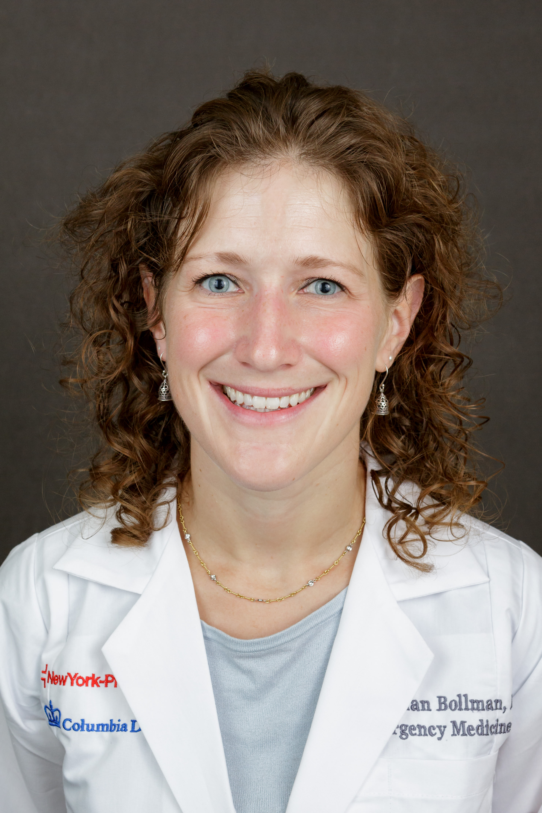

I'm an emergency medicine physician and public health practitioner. Currently, I work as a Global Emergency Medicine Fellow for Columbia University, practicing in two emergency departments in Washington Heights and Inwood. I am also a Masters of Public Health candidate at the Columbia Mailman School of Public Health. Previous to this position in NYC, I completed my residency training in New Orleans at the only level-1 trauma center serving southern Louisiana. 

My current research focuses on improving emergency referral systems in rural Ghana along with colleagues within the Ghana Health Service and Columbia University. I additionally serve as a clinical mentor for the International Rescue Committee's COVID-19 response.

I speak professional Spanish and Haitian Creole, and am learning French. I enjoy hiking, biking, trail running, and (pre-pandemic) tango dancing. 

* [LinkedIn](https://www.linkedin.com/in/brennan-bollman-a451132a)
* [Global EM Fellowship](http://www.iemfellowships.com/programs/26)

## Education

* Residency: Emergency Medicine - Louisiana State University Health Sciences Center, New Orleans, LA

* MD: Harvard Medical School

* B.S.: University of Notre Dame

## [Curriculum Vitae](https://drive.google.com/file/d/1T9hGojrrS7Y11Oa7BYMO9v2JqjxRN4PZ/view?usp=sharing)

## Thank you for visiting!

