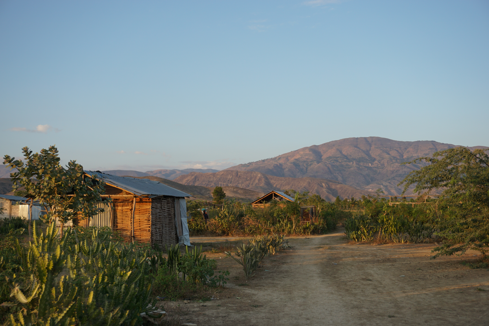

# Data Science for Global Public Health

[About me](about.html)

I am an emergency physician and public health practitioner, with an evolving focus on the use of data science to understand critical problems in emergency care systems and global public health.

Here, you will find examples from my recent data analytic work. 

I have worked to provide emergency medical and public health care in many different communities: Washington Heights in NYC, New Orleans, rural Louisiana, and Haiti. I've learned that our current systems often fail to reach those most in need, the so-called *last mile* of care. Improved data collection and analytics to understand the needs of these last mile communities is critical to advancing our public health aims.

## The last mile in rural Haiti

